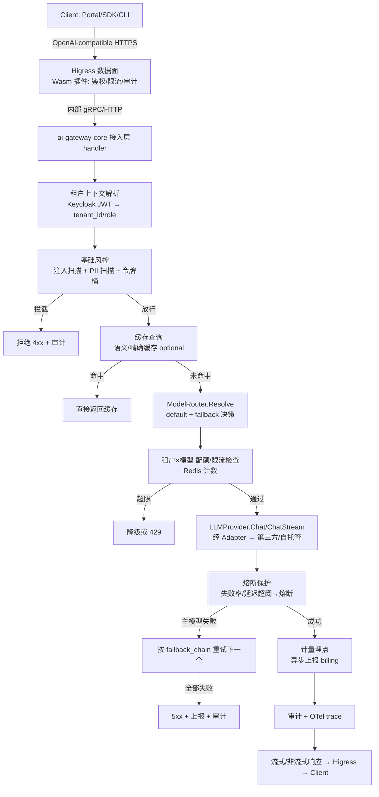
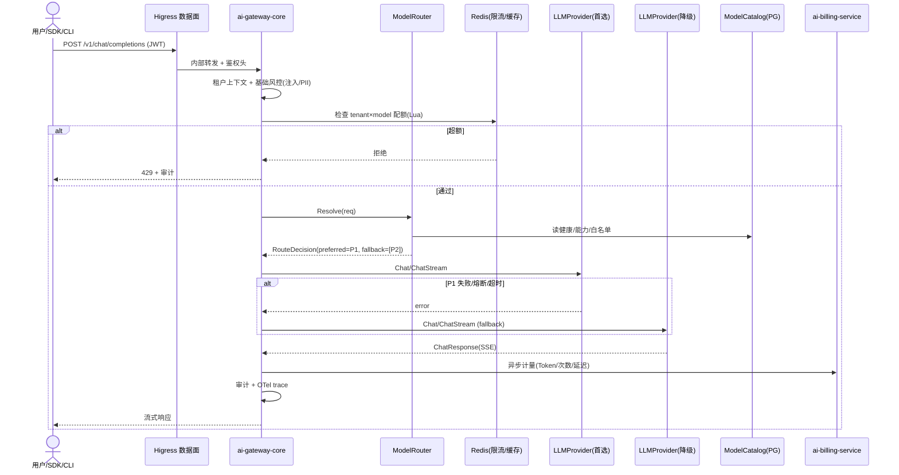

# ai-gateway-core · 详细设计

> **repo**: ai-gateway-core
> **语言·框架**: Go · Hertz/go-zero（热路径）+ Gin + Cobra + Wire（编译期 DI）
> **领域**: runtime（模型服务层 / AI 统一网关）
> **optional**: false（核心必选 · core）
> **平台版本**: v1.4.0
> **文档状态**: 草稿
> **负责人**: OpenStrata 架构组
> **关联链接**: 本仓 [arch/ARCH.md](../../arch/ARCH.md) · [skills/SKILLS.md](../../skills/SKILLS.md) · [specs/SPECS.md](../../specs/SPECS.md) ；架构设计文档 §4.4.1–4.4.6（模型供给）· §4.4.1（AI 统一网关）· §4.7.4（基础风控 core）· §9（K8s 部署）· §10.4（SPI 多实现）· §10.6（Component Registry）· §15.6（DDD 分层 / 技术栈）· §16（BOM）

---

## 1. 定位与边界（Scope）

`ai-gateway-core` 是 OpenStrata 的**数据面入口 + 模型供给中枢**，承载 §4.4.1「AI 统一网关」与 §4.4.4–4.4.6「模型供给体系」。它把"对模型能力的调用"收敛为**单一、标准、可治理的入口**，对上层（Agent 引擎、Portal、SDK、CLI）完全屏蔽模型来源差异（第三方 API / 自托管推理）。

- **本仓解决的唯一问题**：把"N 个模型供应方 × M 种调用协议 × K 类治理诉求（限流/降级/成本/审计）"收敛为一个 OpenAI-compatible 的、可路由、可熔断、可计量、可审计的统一平面。
- **必选性**：核心最小自立组合之一（§4.4.1 / §10.2）。即便只接第三方 LLM API（阶段一~三），本仓也足以成立。
- **与其他 Go 组件的分工**：
  - **ai-gateway-core vs ai-tool-registry**：网关只负责"模型调用"这条数据面；工具注册/调用由 `ai-tool-registry` 经 `ToolRegistry` SPI 承载（§4.3.2），二者在请求链路中串联（网关→工具→网关的模型调用），但职责不重叠。
  - **ai-gateway-core vs ai-platform-api**：`ai-platform-api`（Java）是**控制面编排 + 租户/用户/计量汇总**；网关是**热路径运行时**，不做跨租户结算，只做 `tenant×model` 实时配额/限流与原始计量上报。
  - **ai-gateway-core vs ai-sandbox-manager**：代码执行（沙箱）是另一条数据面，由 `ai-sandbox-manager` 经 `Sandbox` SPI 承载（§4.3.3），网关不执行代码。
  - **ai-gateway-core vs ai-cli**：`ai-cli`（`aictl`）是调用方，通过本仓暴露的 OpenAI-compatible API / CLI 子命令驱动部署，二者是 client/server 关系。

---

## 2. 职责清单

| # | 职责 | 必选/可选 | 说明 |
| --- | --- | --- | --- |
| R1 | OpenAI-compatible API 接入 | core | `/v1/chat/completions`、`/v1/embeddings`、`/v1/rerank`、`/v1/models` 等，归一化上游差异 |
| R2 | 请求路由 / 模型选择 | core | 按 `ModelRouter` 的 `default + fallback_chain` 选源（§4.4.5） |
| R3 | 限流与配额 | core | `tenant×model` 的 QPS / Token 配额；供应商级限流（§4.4.5、§4.7.4 基础风控） |
| R4 | 降级 / 故障转移 | core | 主模型不健康/超时/配额超限→降级链切换；配合熔断器（§4.4.5、§4.4.6） |
| R5 | 成本感知路由 | optional→core(默认开) | 高频流量优先自托管、长尾/稀缺补位第三方（§4.4.5） |
| R6 | 模型目录（ModelRegistry/Catalog） | core | 模型卡片登记：能力/上下文/价格/SLA/健康/租户白名单（§4.4.5） |
| R7 | 语义/精确缓存 | optional（默认关） | Redis Vector Search 语义缓存（§4.3.4） |
| R8 | 密钥托管与出境管控 | core | Provider API Key 存 Vault/K8s Secret，不向租户暴露；PII 脱敏 + 禁止出境策略（§4.4.6） |
| R9 | 基础风控（注入/PII/限流） | core | 下沉为 core，默认开（§4.7.4） |
| R10 | 计量埋点（原始用量上报） | core | Token 输入/输出、调用次数、延迟，异步上报 `ai-billing-service`（§4.7.2） |
| R11 | OTel traces + 不可变审计 | core | 基础可观测性默认开（§4.8） |

---

## 3. 核心抽象与接口（core interfaces / 类型定义）

领域层（§15.6.2 `domain/`）只定义 **Port（接口）**，不依赖具体 Provider。以下为 Go 契约（LLMProvider SPI 版本 `1.0.0`，Gateway SPI 版本 `1.2.0`）。

```go
// ===== LLMProvider SPI（interface_versions.LLMProvider = 1.0.0）=====
// 领域层 Port：与来源无关的模型能力抽象
package domain

type Role string
const (RoleSystem Role = "system"; RoleUser Role = "user"; RoleAssistant Role = "assistant")

type Message struct {
    Role    Role   `json:"role"`
    Content string `json:"content"`
}

type ChatRequest struct {
    Model           string    `json:"model"`            // 目标 model_id（可经路由改写）
    Messages        []Message `json:"messages"`
    Temperature     float32   `json:"temperature,omitempty"`
    MaxTokens       int       `json:"max_tokens,omitempty"`
    Stream          bool      `json:"stream"`           // SSE 流式
    TenantID        string    `json:"-"`                // 由网关中间件注入，不入网
    FallbackChain   []string  `json:"-"`                // AgentSpec.model_binding.fallback_chain
    Capability      string    `json:"-"`                // chat/embedding/rerank/vision/audio
}

type ChatResponse struct {
    Model      string `json:"model"`       // 实际命中的 model_id
    Content    string `json:"content"`
    FinishReason string `json:"finish_reason"`
    Usage      TokenUsage `json:"usage"`
    RoutedFrom string `json:"-"`           // 命中前的首选 model（用于诊断）
}

type TokenUsage struct {
    PromptTokens     int `json:"prompt_tokens"`
    CompletionTokens int `json:"completion_tokens"`
    TotalTokens      int `json:"total_tokens"`
}

// Provider 适配器统一契约：chat / embed / rerank / stream
type LLMProvider interface {
    Chat(ctx context.Context, req ChatRequest) (*ChatResponse, error)
    ChatStream(ctx context.Context, req ChatRequest) (<-chan ChatChunk, error) // SSE 分片
    Embed(ctx context.Context, req EmbedRequest) (*EmbedResponse, error)
    Rerank(ctx context.Context, req RerankRequest) (*RerankResponse, error)
    Health(ctx context.Context) HealthStatus
    Describe() ProviderMeta  // name/version/capability/source
}

type ChatChunk struct {
    Delta  string `json:"delta"`
    Usage  TokenUsage `json:"usage,omitempty"`
    Done   bool   `json:"done"`
}

// ===== 模型路由器 Port（领域层）=====
type ModelRouter interface {
    // Resolve 返回本次请求应选中的 provider 实例 + 降级顺序
    Resolve(ctx context.Context, req ChatRequest) RouteDecision
}

type RouteDecision struct {
    Preferred     string   // model_id
    FallbackChain []string // 降级链 model_id 列表
    Reason        string   // cost/quota/latency/capability
}

// ===== 模型目录 Port（领域层）=====
type ModelCatalog interface {
    Get(modelID string) (ModelCard, bool)
    ListByCapability(cap string, tenantID string) []ModelCard
    UpdateHealth(modelID string, h HealthStatus)
}

// 模型卡片（§4.4.5 字段）
type ModelCard struct {
    ModelID      string   `json:"model_id"`
    Source       string   `json:"source"`        // self_hosted / third_party
    Capability   string   `json:"capability"`    // chat/embedding/rerank/vision/audio
    ContextWindow int     `json:"context_window"`
    PriceIn      float64  `json:"price_in"`      // 每 1M tokens（自托管按内部折算）
    PriceOut     float64  `json:"price_out"`
    LatencySLA   int      `json:"latency_sla_ms"`
    TPS          int      `json:"tps"`
    RateLimit    RateLimit `json:"rate_limit"`
    Health       string   `json:"health"`        // healthy/degraded/down
    TenantAccess []string `json:"tenant_access"` // 白名单；空=全租户
}

type RateLimit struct {
    QPSPerTenant int `json:"qps_per_tenant"`
    TPMPerTenant int `json:"tpm_per_tenant"` // tokens per minute
}
```

`Gateway` SPI（版本 `1.2.0`）由本仓**自身作为实现**暴露给上层，本仓不依赖外部 `Gateway` 实例（Higress 是数据面转发层，见 §6）。

---

## 4. 处理流水线 / 请求路径（接入→路由→限流→SPI 调用→响应，含延迟预算）

请求路径（以一次 `chat/completions` 为例）：



**延迟预算（p95，阶段一~三，纯第三方 API，无自托管）**

| 阶段 | 预算 | 说明 |
| --- | --- | --- |
| 接入层 + 鉴权 | ≤ 15ms | JWT 本地校验 + 租户上下文 |
| 基础风控（注入/PII） | ≤ 10ms | 正则 + 轻量分类器；重模型异步 |
| 缓存查询 | ≤ 5ms | Redis 命中直接返回 |
| 路由决策 | ≤ 2ms | 内存路由表 |
| 配额/限流 | ≤ 3ms | Redis Lua 原子计数 |
| SPI 调用（含网络到第三方） | ≤ 1800ms (p95) | 受 `model_card.latency_sla` 约束；超阈触发降级 |
| 计量/审计 | ≤ 5ms | 异步，不阻塞主路径 |
| **端到端 p95** | **≤ 2000ms** | 与 §4.4.5 `latency_p95 > 2000ms → 降级` 一致 |

> 自托管（阶段四）推理端到端预算由 `local-qwen*` 卡片 SLA 决定；成本感知路由优先把高频流量导到自托管以降低第三方预算消耗。

---

## 5. 关键算法 / 逻辑

### 5.1 路由与故障转移算法（ModelRouter）
输入：`ChatRequest`（含 `FallbackChain`/`Capability`）+ 实时健康/配额/成本状态。
1. 若请求指定 `capability`（如 vision）而首选不支持 → 直接跳到支持该能力的模型（§4.4.5 policy）。
2. 若首选 `health != healthy` 或 `quota_exceeded` → 取降级链第一个可用者。
3. 若 `costAware` 且首选为第三方而自托管有余量 → 优先自托管。
4. 返回 `RouteDecision{Preferred, FallbackChain, Reason}`；调用方按链**顺序重试至多 N 次**。

### 5.2 熔断器（每 provider 实例）
采用半开（half-open）状态机：`Closed → Open（错误率/延迟超阈，冷却窗口 C）→ HalfOpen（放行探活请求）→ Closed/Open`。熔断期间路由直接跳过该 provider，走降级链（§4.4.6）。

### 5.3 限流（令牌桶 + 滑动窗口）
- 维度：`tenant×model` 的 QPS（令牌桶）与 TPM（滑动窗口计数）。
- 实现：Redis Lua 脚本原子扣减；本地 Goroutine 级缓存预热减少 Redis 往返。
- 超限处理：返回 `429` 或按策略降级到配额更宽松的备选（仅当备选存在且未超限）。

### 5.4 语义缓存（optional）
请求标准化（去随机参数）→ Query Embedding（BGE-M3）→ Redis Vector Search → 相似度 > 0.95 命中（§4.3.4）。命中结果异步 TTL=1h 写回。

### 5.5 出境管控（§4.4.6）
调用第三方前做 PII 检测与脱敏；若租户策略为 `deny_egress`，强制仅路由自托管（阶段四）；平台 API Key 不向租户暴露（Vault 托管）。

---

## 6. 与外部系统/组件的适配（OSS / SPI Adapter）

| SPI 端口 | 本仓角色 | 外部组件（来自 bom.yaml） | 默认 ✅ / 备选 | Adapter |
| --- | --- | --- | --- | --- |
| `LLMProvider` (1.0.0) | 消费方 | Qwen/OpenAI/Claude（core）· 自托管 vLLM/TGI（optional, 仅阶段四） | ✅ / 备选 | `ThirdPartyAdapter` / `SelfHostedAdapter` |
| `Gateway` (1.2.0) | 实现方 | Higress（core, 数据面） | ✅ | 数据面由 Higress 转发，控制逻辑在本仓 |
| `Auth` (1.0.0) | 消费方 | Keycloak（core） | ✅ | `AuthAdapter`（JWT 校验） |
| `Cache` (1.0.0) | 消费方 | Redis（core）/ Valkey（optional, OSI 替代） | ✅ / 备选 | `CacheAdapter` |
| `Tracing` (1.0.0) | 消费方 | Langfuse（optional）/ OTel（core） | ✅ / 备选 | `TracingAdapter` |

- **防腐层（ACL）**：所有上游 Provider 响应经 Adapter 归一化为内部 `ChatResponse`/`ChatChunk`；Claude 的 messages 格式、Qwen 的 DashScope 协议、OpenAI 格式均在 Adapter 内收敛（§4.4.5「统一接入与协议归一」）。
- **同类多实现并存**：`LLMProvider` 背后可同时在线多个 Adapter，`ModelRouter` 按请求/租户路由（§10.4）。
- **SPI 端口与 bom.yaml `interface_versions` 对齐**：`LLMProvider: 1.0.0`、`Gateway: 1.2.0`（一致性报告 D3 已修正 `ModelGateway→Gateway`）。

---

## 7. API / CLI / 配置接口面

### 7.1 对外 HTTP（OpenAI-compatible，经 Higress 暴露）
```
POST /v1/chat/completions      # 对话（支持 stream）
POST /v1/embeddings            # 向量化
POST /v1/rerank                # 重排序
GET  /v1/models                # 列出本租户可见 model_id
GET  /v1/healthz               # 存活探针
GET  /metrics                  # Prometheus
```
### 7.2 内部/管控 API（本仓 handler，gRPC 或内网 HTTP）
```
GET  /internal/catalog/models           # 模型目录管理
POST /internal/routing/policy           # 路由策略下发（对接 PlatformManifest modelRouting）
PUT  /internal/provider/{id}/health     # 探活回写
POST /internal/metering/report          # 计量聚合（对接 ai-billing-service）
```
### 7.3 CLI（可选，运维用，非 `aictl`）
`ai-gateway-core` 自身不发布 CLI；平台级 CLI 见 `ai-cli`（`aictl`）。运维可用 `--config` 启动参数。
### 7.4 配置片段（本仓 `infrastructure/config/`，可被元仓渲染）
```yaml
gateway:
  listen: 0.0.0.0:8080
  upstream: higress://ai-system
modelRouting:
  default: cloud-qwen-max
  fallbackChain: [cloud-gpt-4o]
  costAware: true
ratelimit:
  backend: redis
  defaultQPSPerTenant: 20
  defaultTPMPerTenant: 200000
circuitBreaker:
  errorThreshold: 0.5
  cooldownMs: 30000
cache:
  enabled: false            # optional，默认关
  semanticThreshold: 0.95
egress:
  piiScan: true
  denyEgressTenants: []     # 强制仅自托管
```

---

## 8. 数据模型与存储

持久化（base 组件，core）：
- **PostgreSQL**（core）：`model_catalog`（模型卡片）、`routing_policy`（租户路由策略）、`tenant_entitlement`（模型白名单）、`audit_log`（不可变审计，基础 core）。
- **Redis**（core）：限流计数器（QPS/TPM 滑动窗口）、语义缓存向量、路由表热副本、熔断状态。
- 缓存语义缓存可选；Valkey 为 OSI 替代（bom.yaml `Cache`）。

```sql
-- model_catalog 模型卡片（§4.4.5）
CREATE TABLE model_catalog (
  model_id       TEXT PRIMARY KEY,
  source         TEXT NOT NULL,         -- self_hosted | third_party
  capability     TEXT NOT NULL,         -- chat|embedding|rerank|vision|audio
  context_window INT,
  price_in       NUMERIC, price_out NUMERIC,
  latency_sla_ms INT, tps INT,
  rate_limit     JSONB,                 -- {qps_per_tenant,tpm_per_tenant}
  health         TEXT DEFAULT 'healthy',
  tenant_access  JSONB DEFAULT '[]'     -- 白名单
);
```

---

## 9. 并发与性能（goroutine / pool / 背压；网关必写延迟预算与熔断）

- **热路径框架**：Hertz（CloudWeGo）或 go-zero，高并发、低 GC；控制面管理 API 用 Gin。
- **连接池**：每个 Provider Adapter 维持独立 HTTP/gRPC 连接池（`MaxConnsPerHost`、`MaxIdleConns`），避免建连抖动。
- **Goroutine 模型**：每请求一 goroutine（Hertz 默认）；流式响应用独立 goroutine 驱动 SSE 分片写入；计量/审计通过 `chan` + 后台 worker 池异步落盘，不阻塞主路径。
- **背压**：上游 Provider 限流/熔断触发时，本地令牌桶与信号量（`weighted semaphore`）限制在途请求数，防止雪崩；Higress 侧亦配置全局并发上限。
- **延迟预算**：见 §4；所有中间件标注预算，超预算阶段打 WARN trace。
- **熔断**：每 provider 实例独立熔断器（§5.2），冷却窗口 30s，半开放行探活。
- **限流**：Redis Lua 原子计数 + 本地近似计数双层；热点租户本地令牌桶优先，减少 Redis 压力。
- **无状态**：本仓无本地有状态内存（除可重建的路由热副本），可水平扩缩（§9 命名空间 `ai-system`）。

---

## 10. 关键时序图（Mermaid）



---

## 11. 配置与部署（含 K8s 资源/探针）

- **部署形态**：核心必选，部署于 `ai-system` 命名空间（§9.2）。阶段一~三 Docker Compose（starter）/ K8s（standard）；阶段四随 full 档启用自托管 Adapter。
- **镜像**：单二进制（`cmd/` + Wire 装配），`ai-system` 命名空间 Deployment。
- **资源**（参考，非 GPU）：
  - requests: cpu 500m / mem 512Mi；limits: cpu 2 / mem 2Gi。
  - 自托管推理（阶段四）的 vLLM 在 GPU 节点组（§9.1、§9.3），与本仓解耦。
- **探针**：
  - 存活 `GET /v1/healthz`（快速返回）。
  - 就绪 `GET /internal/ready`（校验 PG/Redis/至少一个 provider healthy）。
  - 启动 `initialDelaySeconds: 5`，period `10s`。
- **滚动更新**：多副本 + `maxSurge:1/maxUnavailable:0`，探针保活（§13.3 增量部署原则）。
- **可选性**：非 optional（core）。自托管 `SelfHostedAdapter` 仅在 full 档启用（profiles `optional_disabled` 控制）；Higress、Keycloak、PostgreSQL、Redis 为 base/core 始终在线。

---

## 12. 可观测性 / 安全

- **可观测性（§4.8）**：基础 OTel traces + 不可变审计（core，默认开）；Prometheus 指标（QPS、p50/p95/p99、Token 消耗、错误率、熔断次数、降级次数）；Langfuse（optional，LLM 专项）。
- **安全（§4.4.6 / §4.7.4）**：
  - 密钥安全：Provider API Key 存 Vault / K8s Secret，不向租户暴露（租户只能启用/禁用）。
  - 数据出境：调用第三方前 PII 检测 + 脱敏；`deny_egress` 策略强制仅自托管。
  - 供应商授权：管理员按租户白名单开放第三方模型（`tenant_access`）。
  - 成本计量：自托管 GPU-hour 内部折算 + 第三方 Token 计费，统一上报 `ai-billing-service`。
  - 基础风控下沉 core：限流 + 注入攻击检测 + PII/敏感词扫描默认开。

---

## 13. 测试策略（含压测要点，尤其 gateway）

- **单元测试**：领域层纯逻辑（路由决策、熔断状态机、限流令牌桶、归一化映射）脱离框架运行，快且稳定（§15.6.5）。
- **SPI 契约测试**：每个 `LLMProvider` Adapter 跑同一套契约用例（chat/embed/rerank/stream 形状、错误码、超时），保证多实现语义一致（§15.6.4）。
- **集成测试**：起 PostgreSQL + Redis（testcontainers），验证目录登记/配额/缓存。
- **混沌/降级测试**：注入 provider 故障，验证 fallback 链与熔断切换；验证 `deny_egress` 强制自托管。
- **压测要点（gateway 核心）**：
  - 工具：k6 / ghz，目标 p95 ≤ 2000ms（阶段一~三）、错误率 < 0.1%。
  - 场景：① 纯缓存命中（验证 ≤ 5ms）；② 第三方真实调用（测端到端 p95）；③ 限流（超 `defaultQPSPerTenant` 验证 429）；④ 熔断（provider 注入 50% 错误，验证熔断 + 降级且不雪崩）；⑤ 水平扩容（2→4 副本验证线性吞吐）。
  - 背压：在途请求上限下压测，验证 semaphore 不丢请求但不 OOM。

---

## 14. 开放问题

1. **自托管推理的网关侧 SLA 协商**：阶段四 `SelfHostedAdapter` 的 `latency_sla` 由谁写入模型卡片（Provisioning 还是手动）？需与 `ai-provisioning-engine` 约定。
2. **跨 provider 流式中断的恢复语义**：SSE 中途切换降级模型时，已下发分片如何处理（截断/续传）？需明确客户端契约。
3. **语义缓存与合规**：缓存命中可能跨租户复用同一语义结果，是否需 `tenant_access` 隔离？默认关可规避，但开启时待定。
4. **多租户限流的全局公平性**：纯本地令牌桶无法跨副本公平，需 Redis 权威计数与副本间同步策略。
5. **灰度上新（§4.4.6）**：新模型 5% 流量灰度的切分点在网关还是 ModelRouter？需与 `ai-platform-api` 对齐。
6. **Higress 与网关控制面的职责切分**：哪些 Wasm 插件逻辑（鉴权/限流）应下沉 Higress、哪些留在本仓？待性能基准验证后定。

---

## 变更记录

| 版本 | 日期 | 作者 | 说明 |
| --- | --- | --- | --- |
| v0.1 | 2026-07-17 | OpenStrata 架构组 | 初稿（覆盖占位骨架，14 节完整） |

## 追溯矩阵（本文档章节 ↔ 架构设计文档 § 编号）

| 章节 | 对应架构 § |
| --- | --- |
| 1 定位与边界 | §4.4.1, §10.2, §15.6 |
| 2 职责清单 | §4.4.1, §4.4.5, §4.7.2, §4.7.4, §4.8 |
| 3 核心抽象与接口 | §4.4.4, §4.4.5, §10.3, §10.4, §15.6.2, §16 |
| 4 处理流水线 | §4.4.5, §4.4.6, §4.7.4 |
| 5 关键算法 | §4.4.5, §4.4.6, §4.3.4 |
| 6 外部适配 | §4.4.1, §4.4.4, §10.4, §10.6, §16 |
| 7 API/CLI/配置 | §4.4.1, §4.4.5, §12 |
| 8 数据模型 | §4.4.5, §4.8, §16(base) |
| 9 并发与性能 | §4.4.5, §4.4.6, §15.6 |
| 10 时序图 | §4.4.5, §15.6.2.2 |
| 11 配置部署 | §9.1, §9.2, §12.2, §13.3 |
| 12 可观测性/安全 | §4.4.6, §4.7.4, §4.8 |
| 13 测试策略 | §4.4.5, §15.6.5 |
| 14 开放问题 | §4.4.2, §4.4.6 |
