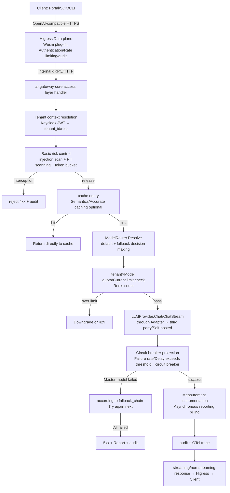
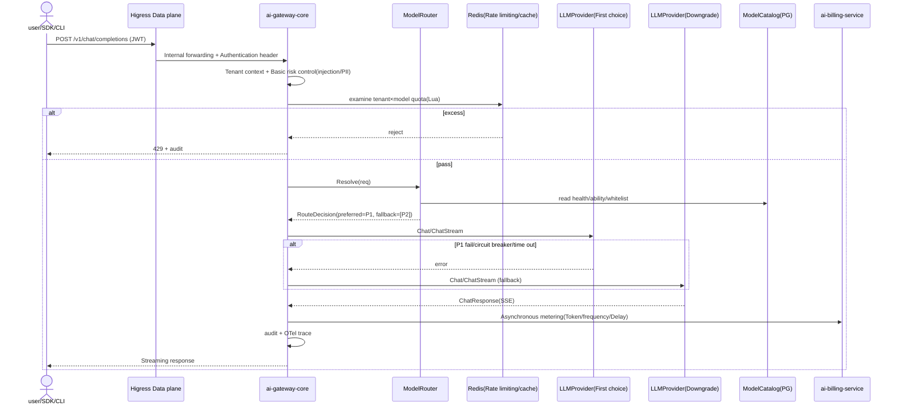

#ai-gateway-core · Detailed design

> **repo**: ai-gateway-core
> **Language · Framework**: Go · Hertz/go-zero (hot path) + Gin + Cobra + Wire (compile-time DI)
> **Field**: runtime (model service layer/AI unified gateway)
> **optional**: false (required for core · core)
> **Platform version**: v1.0.0
> **Document Status**: Draft
> **Responsible Person**: OpenStrata Architecture Group
> **Associated links**: This repository [arch/ARCH.md](../../arch/ARCH.md) · [skills/SKILLS.md](../../skills/SKILLS.md) · [specs/SPECS.md](../../specs/SPECS.md); Architecture design document §4.4.1–4.4.6 (model supply) · §4.4.1 (AI Unified Gateway) · §4.7.4 (Basic Risk Control Core) · §9 (K8s Deployment) · §10.4 (SPI Multiple Implementation) · §10.6 (Component Registry) · §15.5 (DDD Layer/Technology Stack) · §16 (BOM)

---

## 1. Positioning and Boundary (Scope)

`ai-gateway-core` is the **data plane entrance + model supply center** of OpenStrata, carrying §4.4.1 "AI Unified Gateway" and §4.4.4–4.4.6 "Model Supply System". It converges "calls to model capabilities" into a single, standard, manageable entrance, and completely shields model source differences (third-party API/self-hosted inference) from the upper layer (Agent engine, Portal, SDK, CLI).

- **The only problem solved by this repository**: Converging "N model suppliers × M calling protocols × K types of governance requirements (rate limiting/downgrading/cost/auditing)" into a unified plane that is OpenAI-compatible, routable, circuit breakerable, measurable, and auditable.
- **Required**: One of the core minimum self-reliant combinations (§4.4.1 / §10.2). Even if you only connect to the third-party LLM API (stages 1 to 3), this repository is still enough to be established.
- **Division of labor with other Go components**:
- **ai-gateway-core vs ai-tool-registry**: The gateway is only responsible for the "model calling" data plane; tool registration/calling is carried by `ai-tool-registry` via `ToolRegistry` SPI (§4.3.2). The two are connected in series in the request link (gateway → tool → model call of the gateway), but the responsibilities do not overlap.
- **ai-gateway-core vs ai-platform-api**: `ai-platform-api` (Java) is **control plane orchestration + tenant/user/metering summary**; gateway is **hot path runtime**, does not do cross-tenant settlement, only `tenant×model` real-time quota/rate limiting and original metering reporting.
- **ai-gateway-core vs ai-sandbox-manager**: Code execution (sandbox) is another data plane, carried by `ai-sandbox-manager` via `Sandbox` SPI (§4.3.3), the gateway does not execute code.
- **ai-gateway-core vs ai-cli**: `ai-cli` (`aictl`) is the caller and drives deployment through the OpenAI-compatible API/CLI subcommand exposed by this repository. The two are client/server relationships.

---

## 2. Responsibilities List

| # | Responsibilities | Required/Optional | Description |
| --- | --- | --- | --- |
| R1 | OpenAI-compatible API access | core | `/v1/chat/completions`, `/v1/embeddings`, `/v1/rerank`, `/v1/models`, etc., normalized upstream differences |
| R2 | Request routing/model selection | core | Press `default + fallback_chain` of `ModelRouter` to select source (§4.4.5) |
| R3 | Current limit and quota | core | QPS/Token quota of `tenant×model`; supplier-level current limit (§4.4.5, §4.7.4 Basic risk control) |
| R4 | Downgrade/failover | core | Main model unhealthy/timeout/quota exceeded → downgrade chain switching; cooperate with circuit breaker (§4.4.5, §4.4.6) |
| R5 | Cost-aware routing | optional→core (enabled by default) | High-frequency traffic is prioritized for self-hosting, and long-tail/scarce filling third parties (§4.4.5) |
| R6 | Model Catalog (ModelRegistry/Catalog) | core | Model card registration: capabilities/context/price/SLA/health/tenant whitelist (§4.4.5) |
| R7 | Semantic/accurate caching | optional (default off) | Redis Vector Search semantic caching (§4.3.4) |
| R8 | Key escrow and export control | core | Provider API Key stores Vault/K8s Secret and is not exposed to tenants; PII desensitization + export ban policy (§4.4.6) |
| R9 | Basic risk control (injection/PII/rate limiting) | core | push down to core, enabled by default (§4.7.4) |
| R10 | Metering instrumentation (original usage reporting) | core | Token input/output, number of calls, delay, asynchronous reporting `ai-billing-service` (§4.7.2) |
| R11 | OTel traces + immutable auditing | core | Basic observability is on by default (§4.8) |

---

## 3. Core abstraction and interface (core interfaces / type definition)

The domain layer (§15.5.2 `domain/`) only defines **Port (interface)** and does not rely on specific Provider. The following is the Go contract (LLMProvider SPI version `1.0.0`, Gateway SPI version `1.0.0`).

```go
// ===== LLMProvider SPI（interface_versions.LLMProvider = 1.0.0）=====
//Domain layer Port: Source-independent abstraction of model capabilities
package domain

type Role string
const (RoleSystem Role = "system"; RoleUser Role = "user"; RoleAssistant Role = "assistant")

type Message struct {
    Role    Role   `json:"role"`
    Content string `json:"content"`
}

type ChatRequest struct {
    Model           string    `json:"model"`            //Target model_id (can be overridden via routing)
    Messages        []Message `json:"messages"`
    Temperature     float32   `json:"temperature,omitempty"`
    MaxTokens       int       `json:"max_tokens,omitempty"`
    Stream          bool      `json:"stream"`           //SSE streaming
    TenantID        string    `json:"-"`                //Injected by gateway middleware and not connected to the network
    FallbackChain   []string  `json:"-"`                // AgentSpec.model_binding.fallback_chain
    Capability      string    `json:"-"`                // chat/embedding/rerank/vision/audio
}

type ChatResponse struct {
    Model      string `json:"model"`       //The model_id of the actual hit
    Content    string `json:"content"`
    FinishReason string `json:"finish_reason"`
    Usage      TokenUsage `json:"usage"`
    RoutedFrom string `json:"-"`           //Preferred model before hit (used for diagnostics)
}

type TokenUsage struct {
    PromptTokens     int `json:"prompt_tokens"`
    CompletionTokens int `json:"completion_tokens"`
    TotalTokens      int `json:"total_tokens"`
}

//Provider adapter unified contract: chat / embed / rerank / stream
type LLMProvider interface {
    Chat(ctx context.Context, req ChatRequest) (*ChatResponse, error)
    ChatStream(ctx context.Context, req ChatRequest) (<-chan ChatChunk, error) //SSE Sharding
    Embed(ctx context.Context, req EmbedRequest) (*EmbedResponse, error)
    Rerank(ctx context.Context, req RerankRequest) (*RerankResponse, error)
    Health(ctx context.Context) HealthStatus
    Describe() ProviderMeta  // name/version/capability/source
}

type ChatChunk struct {
    Delta  string `json:"delta"`
    Usage  TokenUsage `json:"usage,omitempty"`
    Done   bool   `json:"done"`
}

//===== Model Router Port (Domain Layer) =====
type ModelRouter interface {
    //Resolve returns the provider instance that should be selected for this request + the downgrade order
    Resolve(ctx context.Context, req ChatRequest) RouteDecision
}

type RouteDecision struct {
    Preferred     string   // model_id
    FallbackChain []string //Downgrade chain model_id list
    Reason        string   // cost/quota/latency/capability
}

//===== Model directory Port (domain layer) =====
type ModelCatalog interface {
    Get(modelID string) (ModelCard, bool)
    ListByCapability(cap string, tenantID string) []ModelCard
    UpdateHealth(modelID string, h HealthStatus)
}

//Model Card (§4.4.5 Field)
type ModelCard struct {
    ModelID      string   `json:"model_id"`
    Source       string   `json:"source"`        // self_hosted / third_party
    Capability   string   `json:"capability"`    // chat/embedding/rerank/vision/audio
    ContextWindow int     `json:"context_window"`
    PriceIn      float64  `json:"price_in"`      //Every 1M tokens (self-hosted based on internal conversion)
    PriceOut     float64  `json:"price_out"`
    LatencySLA   int      `json:"latency_sla_ms"`
    TPS          int      `json:"tps"`
    RateLimit    RateLimit `json:"rate_limit"`
    Health       string   `json:"health"`        // healthy/degraded/down
    TenantAccess []string `json:"tenant_access"` //Whitelist; empty = all tenants
}

type RateLimit struct {
    QPSPerTenant int `json:"qps_per_tenant"`
    TPMPerTenant int `json:"tpm_per_tenant"` // tokens per minute
}
```

`Gateway` SPI (version `1.0.0`) is exposed to the upper layer by the repository itself as an implementation. This repository does not rely on external `Gateway` instances (Higress is the data plane forwarding layer, see §6).

---

## 4. Processing pipeline/request path (access→routing→rate limiting→SPI call→response, including delay budget)

Request path (take `chat/completions` as an example):



**Latency budget (p95, stages 1~3, pure third-party API, no self-hosting)**

| Phase | Budget | Description |
| --- | --- | --- |
| Access layer + authentication | ≤ 15ms | JWT local verification + tenant context |
| Basic risk control (injection/PII) | ≤ 10ms | Regular + lightweight classifier; heavy model asynchronous |
| Cache query | ≤ 5ms | Redis hits are returned directly |
| Routing decision | ≤ 2ms | Memory routing table |
| Quota/current limit | ≤ 3ms | Redis Lua atomic count |
| SPI call (including network to third party) | ≤ 1800ms (p95) | Subject to `model_card.latency_sla`; exceeding the threshold triggers degradation |
| Metering/auditing | ≤ 5ms | Asynchronous, does not block the main path |
| **End-to-end p95** | **≤ 2000ms** | Consistent with §4.4.5 `latency_p95 > 2000ms → downgrade` |

> Self-hosted (Phase 4) inference end-to-end budget is determined by `local-qwen*` card SLA; cost-aware routing prioritizes high-frequency traffic to self-hosted to reduce third-party budget consumption.

---

## 5. Key algorithm/logic

### 5.1 Routing and failover algorithm (ModelRouter)
Input: `ChatRequest` (with `FallbackChain`/`Capability`) + real-time health/quota/cost status.
1. If the request specifies `capability` (such as vision) and the first choice does not support it → jump directly to the model that supports the capability (§4.4.5 policy).
2. If `health != healthy` or `quota_exceeded` is preferred → take the first available one in the downgrade chain.
3. If `costAware` is used and the third party is preferred and there is room for self-hosting → Prioritize self-hosting.
4. Return `RouteDecision{Preferred, FallbackChain, Reason}`; the caller retries up to N times** in chain** order.

### 5.2 Circuit breakers (per provider instance)
Use a half-open state machine: `Closed → Open (error rate/latency exceeds threshold, cooling window C) → HalfOpen (release probe request) → Closed/Open`. During the circuit breaker period, the route directly skips the provider and follows the downgrade chain (§4.4.6).

### 5.3 Rate limiting (token bucket + sliding window)
- Dimension: QPS (token bucket) and TPM (sliding window count) of `tenant×model`.
- Implementation: Redis Lua script atomic deduction; local Goroutine-level cache warm-up reduces Redis round-trips.
- Over-limit processing: Return `429` or downgrade to an alternative with a looser quota according to the policy (only if the alternative exists and does not exceed the limit).

### 5.4 Semantic caching (optional)
Request normalization (de-randomized parameters) → Query Embedding (BGE-M3) → Redis Vector Search → Similarity > 0.95 hits (§4.3.4). Hit result is written back asynchronously with TTL=1h.

### 5.5 Exit control (§4.4.6)
Perform PII detection and desensitization before calling the third party; if the tenant policy is `deny_egress`, it is forced to only route self-hosting (stage 4); the platform API Key is not exposed to tenants (Vault hosting).

---

## 6. Adaptation with external systems/components (OSS/SPI Adapter)

| SPI port | Repository role | External component (from bom.yaml) | Default ✅ / Alternative | Adapter |
| --- | --- | --- | --- | --- |
| `LLMProvider` (1.0.0) | Consumer | Qwen/OpenAI/Claude (core) · Self-hosted vLLM/TGI (optional, phase four only) | ✅ / Alternative | `ThirdPartyAdapter` / `SelfHostedAdapter` |
| `Gateway` (1.0.0) | Implementer | Higress (core, data plane) | ✅ | The data plane is forwarded by Higress, and the control logic is in this repository |
| `Auth` (1.0.0) | Consumer | Keycloak (core) | ✅ | `AuthAdapter` (JWT verification) |
| `Cache` (1.0.0) | Consumer | Redis (core) / Valkey (optional, OSI alternative) | ✅ / Alternative | `CacheAdapter` |
| `Tracing` (1.0.0) | Consumer | Langfuse (optional) / OTel (core) | ✅ / Alternative | `TracingAdapter` |

- **Anti-Corruption Layer (ACL)**: All upstream Provider responses are normalized by the Adapter into internal `ChatResponse`/`ChatChunk`; Claude's messages format, Qwen's DashScope protocol, and OpenAI format are all converged within the Adapter (§4.4.5 "Unified Access and Protocol Normalization").
- **Multiple implementations of the same type coexist**: `LLMProvider` can have multiple Adapters online at the same time, and `ModelRouter` routes by request/tenant (§10.4).
- **SPI ports aligned with bom.yaml `interface_versions`**: `LLMProvider: 1.0.0`, `Gateway: 1.0.0` (conformance report D3 fixed `ModelGateway→Gateway`).

---

## 7. API / CLI / Configuration interface

### 7.1 External HTTP (OpenAI-compatible, exposed by Higress)
```
POST /v1/chat/completions      #Conversation (supports stream)
POST /v1/embeddings            #vectorization
POST /v1/rerank                #Reorder
GET  /v1/models                #List the model_id visible to this tenant
GET  /v1/healthz               #survival probe
GET  /metrics                  # Prometheus
```
### 7.2 Internal/control API (repository handler, gRPC or intranet HTTP)
```
GET  /internal/catalog/models           #Model catalog management
POST /internal/routing/policy           #Routing policy delivery (connected to PlatformManifest modelRouting)
PUT  /internal/provider/{id}/health     #Exploring life and writing back
POST /internal/metering/report          #Metering aggregation (interconnected with ai-billing-service)
```
### 7.3 CLI (optional, for operation and maintenance, not `aictl`)
`ai-gateway-core` does not publish a CLI itself; see `ai-cli` (`aictl`) for platform-level CLI. The `--config` startup parameter can be used for operation and maintenance.
### 7.4 Configuration fragment (this repository `infrastructure/config/`, can be rendered by Yuan repository)
```yaml
gateway:
  listen: 0.0.0.0:8080
  upstream: higress://ai-system
modelRouting:
  default: cloud-qwen-max
  fallbackChain: [cloud-gpt-4o]
  costAware: true
ratelimit:
  backend: redis
  defaultQPSPerTenant: 20
  defaultTPMPerTenant: 200000
circuitBreaker:
  errorThreshold: 0.5
  cooldownMs: 30000
cache:
  enabled: false            #optional, default off
  semanticThreshold: 0.95
egress:
  piiScan: true
  denyEgressTenants: []     #Force self-hosting only
```

---

## 8. Data model and storage

Persistence (base component, core):
- **PostgreSQL** (core): `model_catalog` (model card), `routing_policy` (tenant routing policy), `tenant_entitlement` (model whitelist), `audit_log` (immutable audit, basic core).
- **Redis** (core): current limit counter (QPS/TPM sliding window), semantic cache vector, routing table hot copy, circuit breaker status.
- Cache semantic caching is optional; Valkey is an OSI replacement (bom.yaml `Cache`).

```sql
-- model_catalog model card（§4.4.5）
CREATE TABLE model_catalog (
  model_id       TEXT PRIMARY KEY,
  source         TEXT NOT NULL,         -- self_hosted | third_party
  capability     TEXT NOT NULL,         -- chat|embedding|rerank|vision|audio
  context_window INT,
  price_in       NUMERIC, price_out NUMERIC,
  latency_sla_ms INT, tps INT,
  rate_limit     JSONB,                 -- {qps_per_tenant,tpm_per_tenant}
  health         TEXT DEFAULT 'healthy',
  tenant_access  JSONB DEFAULT '[]'     -- whitelist
);
```

---

## 9. Concurrency and performance (goroutine / pool / back pressure; gateway must write delay budget and circuit breaker)

- **Hot path framework**: Hertz (CloudWeGo) or go-zero, high concurrency, low GC; control plane management API uses Gin.
- **Connection pool**: Each Provider Adapter maintains an independent HTTP/gRPC connection pool (`MaxConnsPerHost`, `MaxIdleConns`) to avoid jitter in connection establishment.
- **Goroutine model**: one goroutine per request (Hertz default); streaming responses are written in SSE shards using independent goroutine drivers; metering/auditing is done asynchronously through `chan` + background worker pool, without blocking the main path.
- **Backpressure**: When the upstream Provider current limit/circuit breaker is triggered, the local token bucket and semaphore (`weighted semaphore`) limit the number of requests in transit to prevent avalanches; the Higress side is also configured with a global concurrency upper limit.
- **Delay budget**: See §4; all middleware is marked with budget, and a WARN trace is displayed when the budget exceeds the budget.
- **Circuit breaker**: Independent circuit breaker for each provider instance (§5.2), cooling window 30s, semi-open line exploration.
- **Rate limiting**: Redis Lua atomic counting + local approximate counting dual layer; hotspot tenant local token bucket priority, reducing Redis pressure.
- **Stateless**: This repository has no local stateful memory (except for rebuildable routing hot copies) and can be scaled horizontally (§9 namespace `ai-system`).

---

## 10. Key sequence diagram (Mermaid)



---

## 11. Configuration and deployment (including K8s resources/probes)

- **Deployment form**: Core is required and deployed in the `ai-system` namespace (§9.2). Phases 1 to 3: Docker Compose (starter)/K8s (standard); Phase 4 enables self-hosted Adapter with the full file.
- **Image**: Single binary (`cmd/` + Wire assembly), `ai-system` namespace Deployment.
- **Resources** (reference, non-GPU):
  - requests: cpu 500m / mem 512Mi；limits: cpu 2 / mem 2Gi。
- The vLLM of self-hosted inference (Phase 4) is in the GPU node group (§9.1, §9.3), decoupled from the main repository.
- **Probe**:
- Survive `GET /v1/healthz` (quick return).
- Ready `GET /internal/ready` (verify that PG/Redis/at least one provider is healthy).
- Start with `initialDelaySeconds: 5`, period `10s`.
- **Rolling update**: multiple copies + `maxSurge:1/maxUnavailable:0`, probe keep alive (§13.3 Incremental deployment principle).
- **OPTIONAL**: Not optional (core). Self-hosted `SelfHostedAdapter` is only enabled in the full profile (profiles `optional_disabled` control); Higress, Keycloak, PostgreSQL, and Redis are always online for base/core.

---

## 12. Observability / Security

- **Observability (§4.8)**: Basic OTel traces + immutable auditing (core, enabled by default); Prometheus indicators (QPS, p50/p95/p99, Token consumption, error rate, number of circuit breakers, number of downgrades); Langfuse (optional, LLM special project).
- **Safety (§4.4.6 / §4.7.4)**:
- Key security: Provider API Key stores Vault/K8s Secret and is not exposed to tenants (tenants can only enable/disable it).
- Data outbound: PII detection + desensitization before calling third party; `deny_egress` policy enforces self-hosting only.
- Supplier authorization: Administrators open third-party models (`tenant_access`) by tenant whitelist.
- Cost measurement: self-hosted GPU-hour internal conversion + third-party Token billing, unified reporting to `ai-billing-service`.
- Basic risk control pushed down into the core: rate limiting + injection attack detection + PII/sensitive word scanning is enabled by default.

---

## 13. Test strategy (including key points of stress testing, especially gateway)

- **Unit Test**: Domain layer pure logic (routing decisions, circuit breaker state machines, current-limiting token buckets, normalized mapping) runs out of the framework, fast and stable (§15.5.5).
- **SPI Contract Test**: Each `LLMProvider` Adapter runs the same set of contract use cases (chat/embed/rerank/stream shape, error code, timeout) to ensure consistent semantics across multiple implementations (§15.5.4).
- **Integration Test**: Starting with PostgreSQL + Redis (testcontainers), verify directory registration/quotas/cache.
- **Chaos/Downgrade Test**: Inject provider failure, verify fallback chain and circuit breaker switching; verify `deny_egress` enforces self-hosting.
- **Key points of stress testing (gateway core)**:
- Tool: k6/ghz, target p95 ≤ 2000ms (stages 1 to 3), error rate < 0.1%.
- Scenarios: ① pure cache hit (verification ≤ 5ms); ② third-party real call (test end-to-end p95); ③ rate limiting (exceeding `defaultQPSPerTenant` verification 429); ④ circuit breaker (provider injects 50% errors, verification circuit breaker + degradation without avalanche); ⑤ horizontal expansion (2→4 replicas to verify linear throughput).
- Backpressure: Stress test under the upper limit of in-transit requests to verify that the semaphore does not lose requests but does not OOM.

---

## 14. Open questions

1. **Gateway-side SLA negotiation for self-hosted inference**: Phase 4 Who writes the `latency_sla` of `SelfHostedAdapter` to the model card (Provisioning or manual)? Need to be agreed with `ai-provisioning-engine`.
2. **Recovery semantics of cross-provider streaming interruption**: When SSE switches to the downgrade model midway, how to deal with the delivered fragments (truncation/resumption)? The client contract needs to be clear.
3. **Semantic Caching and Compliance**: Cache hits may reuse the same semantic results across tenants. Does `tenant_access` need to be isolated? It can be circumvented by default, but it is to be determined when it is enabled.
4. **Global fairness of multi-tenant rate limiting**: Purely local token buckets cannot be fair across replicas, and Redis authoritative counting and synchronization strategies between replicas are required.
5. **Canary update (§4.4.6)**: Is the dividing point of 5% canary traffic of the new model at the gateway or ModelRouter? Need to be aligned with `ai-platform-api`.
6. **Separation of responsibilities between Higress and gateway control plane**: Which Wasm plug-in logic (authentication/rate limiting) should be moved to Higress, and which should be kept in this repository? Pending performance benchmark verification.

---

## Change record

| Version | Date | Author | Description |
| --- | --- | --- | --- |
| v0.1 | 2026-07-17 | OpenStrata Architecture Group | First draft (covering the placeholder skeleton, complete with 14 sections) |

## Traceability Matrix (Chapter of this document ↔ Architecture Design Document § Number)

| Chapter | Corresponding Architecture § |
| --- | --- |
| 1 Positioning and Boundaries | §4.4.1, §10.2, §15.5 |
| 2 Responsibilities List | §4.4.1, §4.4.5, §4.7.2, §4.7.4, §4.8 |
| 3 Core Abstractions and Interfaces | §4.4.4, §4.4.5, §10.3, §10.4, §15.5.2, §16 |
| 4 Processing Pipeline | §4.4.5, §4.4.6, §4.7.4 |
| 5 Key Algorithms | §4.4.5, §4.4.6, §4.3.4 |
| 6 External adaptation | §4.4.1, §4.4.4, §10.4, §10.6, §16 |
| 7 API/CLI/Configuration | §4.4.1, §4.4.5, §12 |
| 8 Data Model | §4.4.5, §4.8, §16(base) |
| 9 Concurrency and Performance | §4.4.5, §4.4.6, §15.5 |
| 10 Timing diagram | §4.4.5, §15.5.2.2 |
| 11 Configuration Deployment | §9.1, §9.2, §12.2, §13.3 |
| 12 Observability/Security | §4.4.6, §4.7.4, §4.8 |
| 13 Testing Strategy | §4.4.5, §15.5.5 |
| 14 Open Questions | §4.4.2, §4.4.6 |
